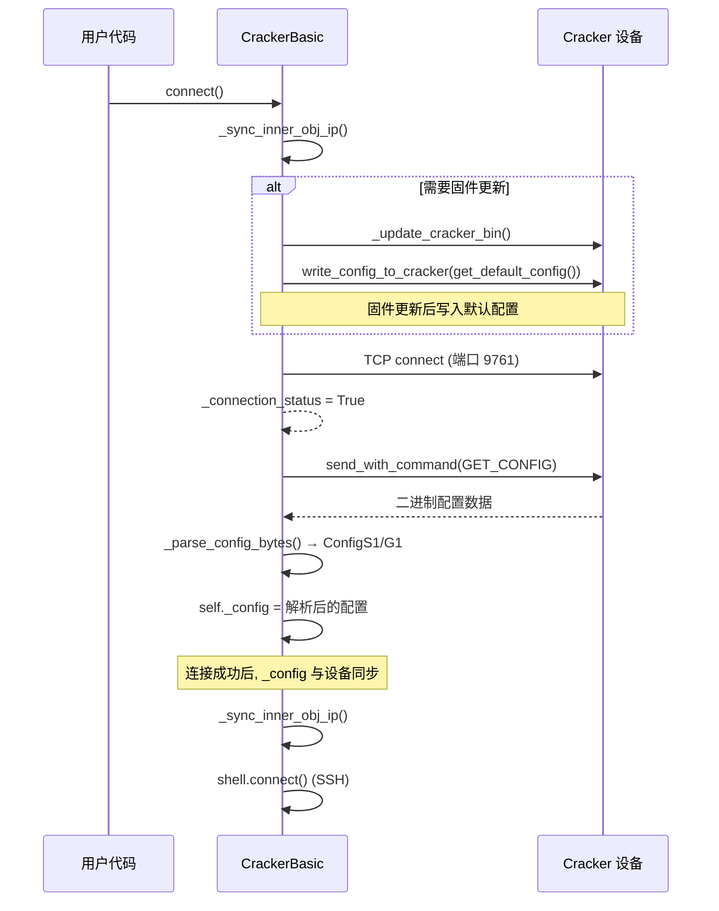
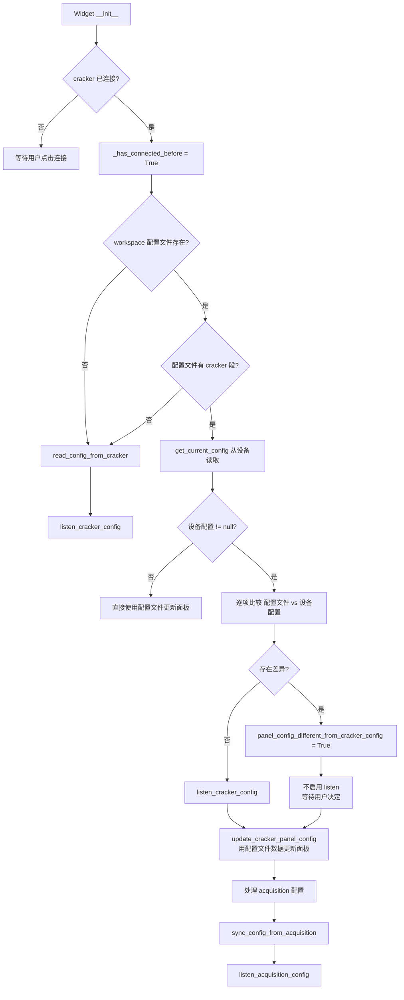
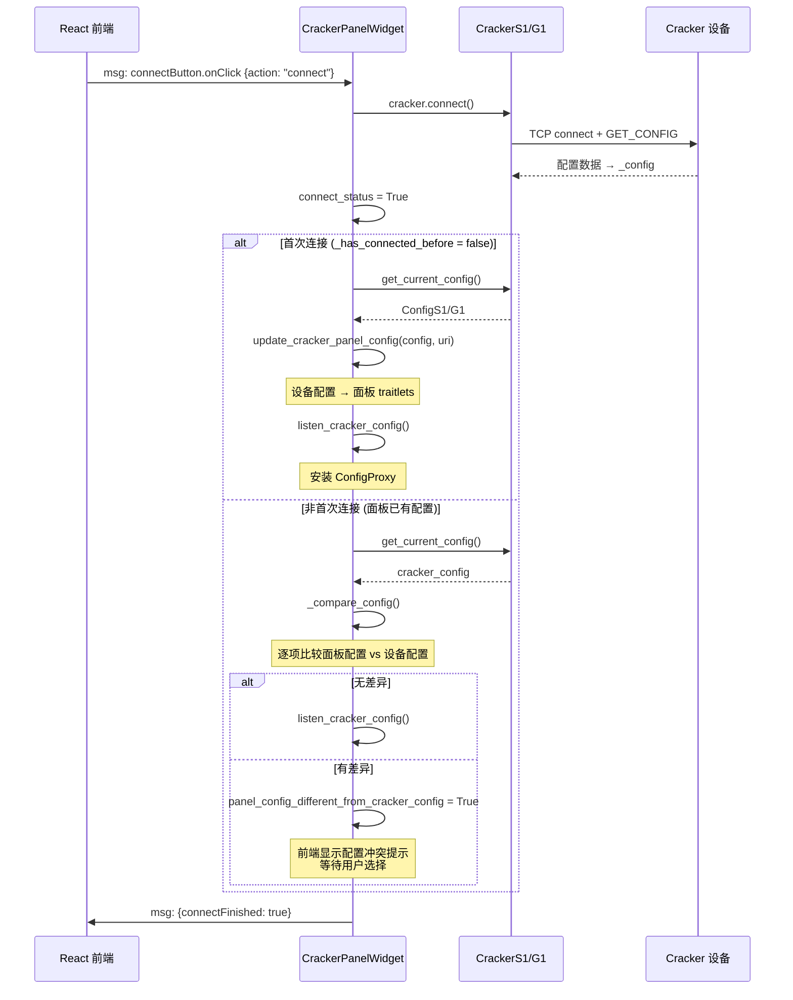
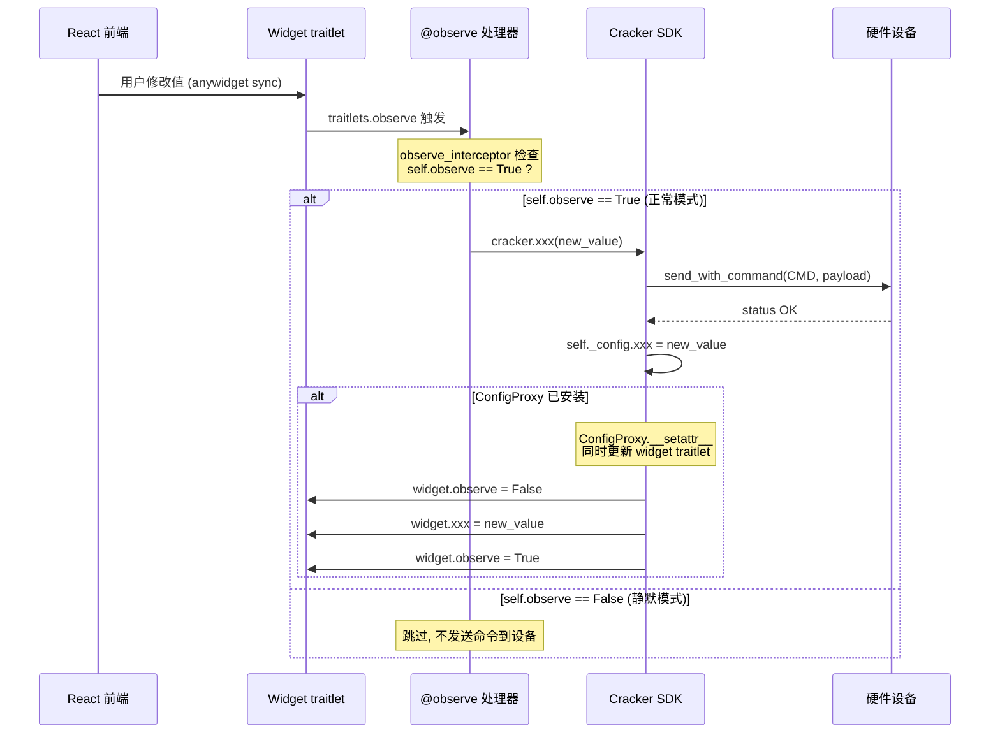
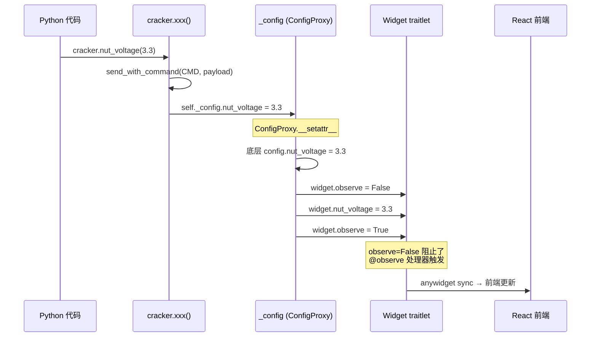
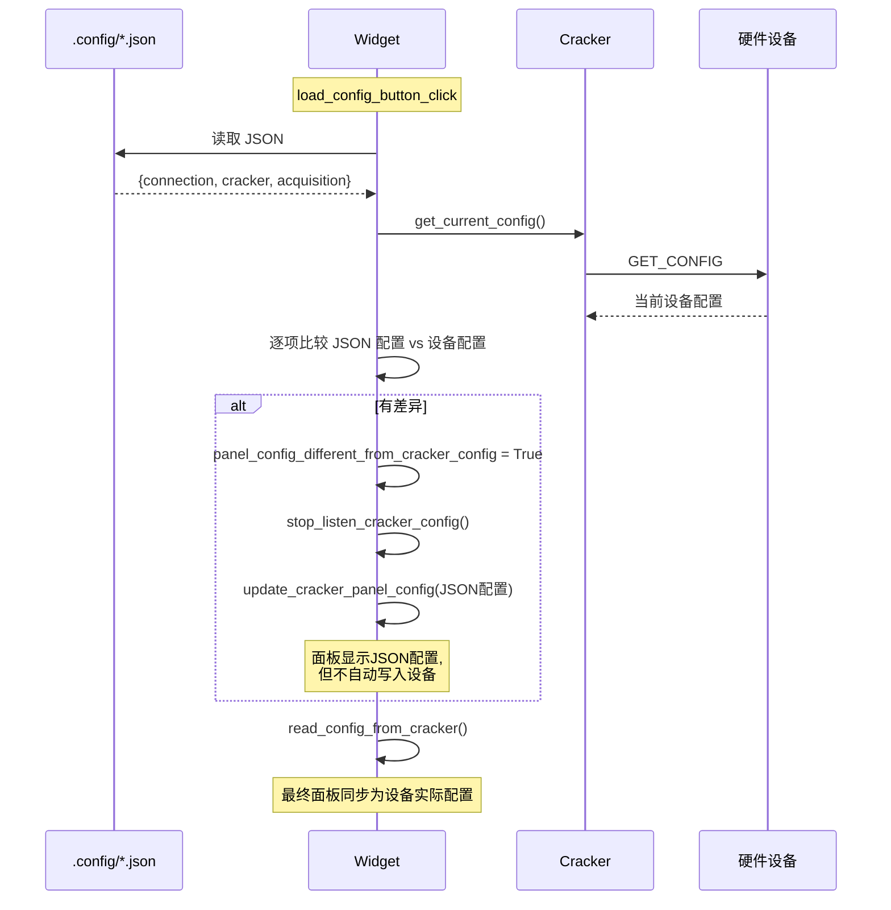
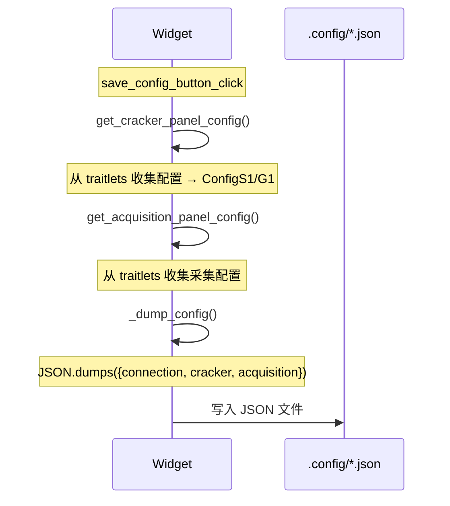
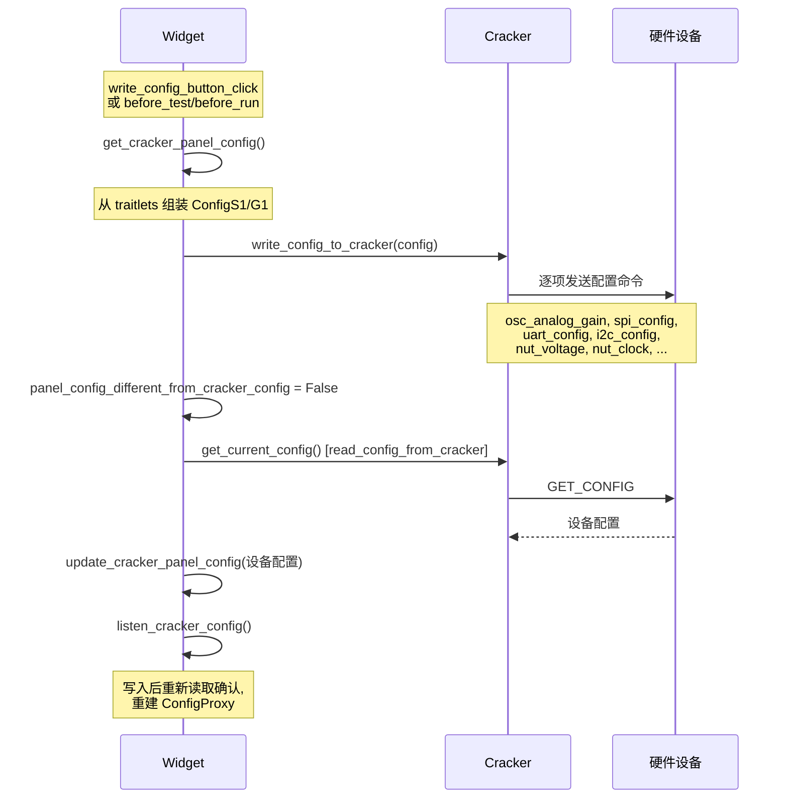
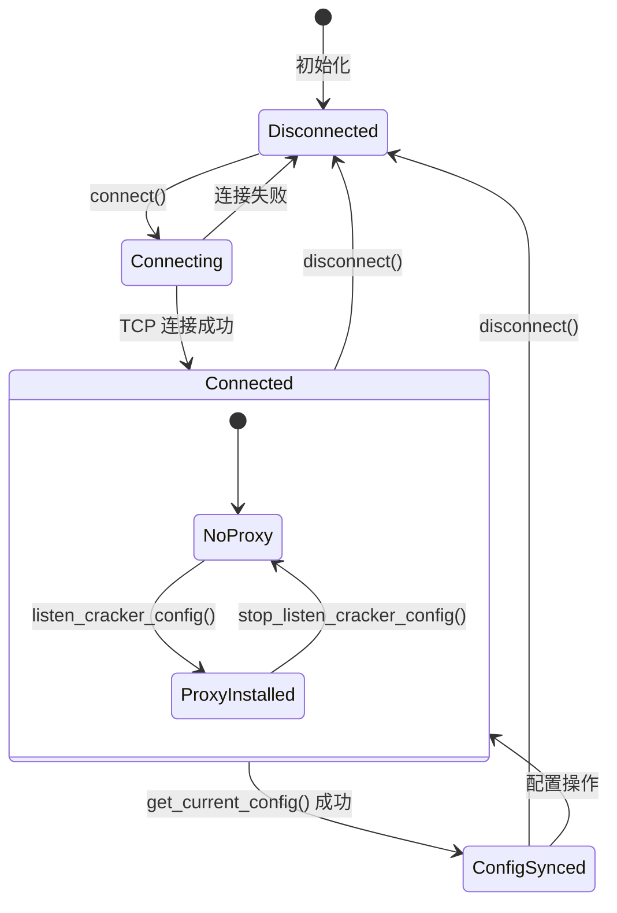
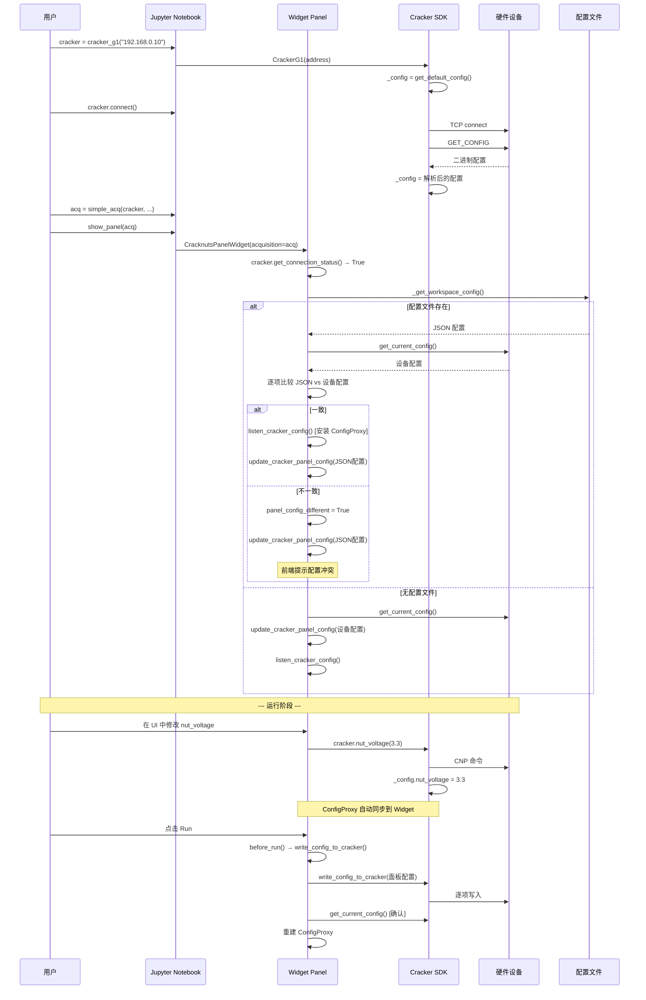

# Cracker 连接与配置同步流程分析

> 基于 cracknuts v0.22.2 源码分析
> 分析日期: 2026-03-25

---

## 1. 四层架构概览

```
┌─────────────────────────────────────────────────────────────────┐
│  Layer 4: 配置文件 (持久化层)                                     │
│  .config/<notebook-name>.json                                   │
│  JSON 格式: { connection, cracker, acquisition }                │
├─────────────────────────────────────────────────────────────────┤
│  Layer 3: Jupyter Widget UI (前端交互层)                          │
│  CracknutsPanelWidget / WorkbenchG1Panel                        │
│  traitlets 属性 ←→ React/TS 前端 (anywidget)                    │
├─────────────────────────────────────────────────────────────────┤
│  Layer 2: Python 运行时 (SDK 层)                                 │
│  CrackerBasic[T] → CrackerS1 → CrackerG1                       │
│  内存中的 _config: ConfigS1/ConfigG1 对象                        │
├─────────────────────────────────────────────────────────────────┤
│  Layer 1: Cracker 设备 (硬件层)                                   │
│  CNP 协议 TCP 通信 (端口 9761)                                   │
│  二进制寄存器配置                                                 │
└─────────────────────────────────────────────────────────────────┘
```

---

## 2. 各层配置数据结构

### 2.1 Layer 1: 硬件层 - 二进制配置

设备通过 CNP 协议的 `GET_CONFIG` 命令返回紧凑的二进制配置数据, 由 `struct` 模块按大端序解析。

**S1 二进制布局** (定义于 `CrackerS1._get_config_bytes_format()`):

| 字段 | 格式 | 说明 |
|------|------|------|
| `nut_enable` | `?` (bool) | NUT 电源使能 |
| `nut_voltage` | `I` (uint32) | NUT 电压 (mV) |
| `nut_clock_enable` | `?` | NUT 时钟使能 |
| `nut_clock` | `I` | NUT 时钟频率 (kHz) |
| `nut_reset_io_enable` | `?` | 复位 IO 使能 |
| `osc_sample_clock` | `I` | 采样时钟 |
| `osc_sample_phase` | `I` | 采样相位 |
| `osc_sample_length` | `I` | 采样长度 |
| `osc_sample_delay` | `I` | 采样延迟 |
| `osc_channel_0/1_enable` | `?` | 通道使能 |
| `osc_channel_0/1_gain` | `B` | 通道增益 |
| `osc_trigger_*` | `B/H` | 触发配置 |
| `nut_i2c_*` | `?/B` | I2C 配置 |
| `nut_uart_*` | `?/B` | UART 配置 |
| `nut_spi_*` | `?/H/B` | SPI 配置 |

**G1 在 S1 基础上扩展** (定义于 `CrackerG1._get_config_bytes_format()`):

| 字段 | 格式 | 说明 |
|------|------|------|
| `glitch_vcc_arm` | `?` | VCC Glitch ARM |
| `glitch_vcc_normal` | `I` | VCC 正常电压 (DAC code) |
| `glitch_vcc_config_*` | `I` | VCC Glitch 参数 |
| `glitch_gnd_*` | `?/I` | GND Glitch 参数 |
| `glitch_clock_*` | `?/I` | Clock Glitch 参数 |

**特殊转换**:
- `nut_voltage`: 设备存储 mV, SDK 层转换为 V (`v / 1000`)
- `nut_spi_speed`: 设备存储分频值, SDK 转换为 kHz (`100e6 / 2 / v`)
- `glitch_vcc_normal/level`: 设备存储 DAC code, SDK 通过插值表转换为电压值
- `glitch_clock_*`: 设备仅存储波形长度, SDK 根据长度重建波形数组

### 2.2 Layer 2: SDK 层 - Config 对象

```python
# 继承链
ConfigBasic          # osc_* 基础示波器配置
  └── ConfigS1       # nut_* NUT/串口配置
        └── ConfigG1 # glitch_* 故障注入配置
```

**核心特征**:
- 普通 Python 类 (非 dataclass), 属性通过 `__init__` 定义
- 序列化/反序列化: `dump_to_json()` / `load_from_json()` (过滤 `_` 前缀属性)
- 存储位置: `CrackerBasic._config` 实例属性

**关键方法**:

| 类 | 方法 | 职责 |
|----|------|------|
| `CrackerBasic` | `get_default_config()` | 抽象方法, 返回默认配置 |
| `CrackerBasic` | `get_current_config()` | 从设备读取当前配置 |
| `CrackerBasic` | `write_config_to_cracker(config)` | 将配置逐项写入设备 |
| `CrackerS1` | `_parse_config_bytes(bytes)` | 解析二进制配置 |
| `CrackerS1` | `_update_config_from_cracker()` | 从设备读取并更新 `_config` |

### 2.3 Layer 3: Widget UI 层 - traitlets 属性

Widget 层使用 `traitlets` 属性实现 Python-JS 双向同步。

**CrackerPanelWidget (S1 面板)** 的 traitlets:

```python
# 连接状态
uri = traitlets.Unicode("cnp://192.168.0.10:8080").tag(sync=True)
connect_status = traitlets.Bool(False).tag(sync=True)

# NUT 配置 (与 ConfigS1 对应)
nut_enable = traitlets.Bool(False).tag(sync=True)
nut_voltage = traitlets.Float(3.3).tag(sync=True)
nut_clock_enable = traitlets.Bool(False).tag(sync=True)
nut_clock = traitlets.Float(65000).tag(sync=True)
# ... 更多 osc_*, nut_uart_*, nut_spi_*, nut_i2c_* 属性

# 配置差异标记
panel_config_different_from_cracker_config = traitlets.Bool(False).tag(sync=True)
```

**CrackerG1Panel** 额外的 traitlets (通过 ConfigG1Glitch mixin):

```python
glitch_vcc_normal = traitlets.Float(3.3).tag(sync=True)
glitch_vcc_config_wait/level/count/delay/repeat = traitlets.Int/Float
glitch_gnd_* = ...
glitch_clock_config_wait/delay/repeat = traitlets.Int
glitch_clock_normal_selected_freq_item_idx = traitlets.Int
glitch_clock_glitch_selected_freq_item_idx = traitlets.Int
```

### 2.4 Layer 4: 配置文件 - JSON

路径: `<notebook-dir>/.config/<notebook-name>.json`

```json
{
    "connection": "cnp://192.168.0.10:8080",
    "cracker": {
        "osc_channel_0_enable": false,
        "osc_channel_1_enable": true,
        "nut_voltage": 3.3,
        "nut_clock": 8000,
        "glitch_vcc_normal": 3.3,
        ...
    },
    "acquisition": {
        "trace_count": 1000,
        "sample_length": 1024,
        ...
    }
}
```

路径发现逻辑 (`_get_workspace_config_path()`):
1. 检查 `__vsc_ipynb_file__` (VS Code Jupyter)
2. 检查 `__session__` (JupyterLab)
3. 如都不存在, 返回 `None` (不使用配置文件)

---

## 3. 连接时配置同步流程

### 3.1 纯 Python API 连接 (无 Widget)



**关键代码** (`CrackerBasic.connect()`, 第 512-585 行):

```python
def connect(self, update_bin=True, force_update_bin=False, ...):
    # ...
    self._socket.connect(self._server_address)
    self._connection_status = True

    if (update_bin and bin_updated) or force_write_default_config:
        self.write_config_to_cracker(self.get_default_config())

    self._config = self.get_current_config()  # 从设备读取配置到SDK
```

### 3.2 Widget 面板初始化 (已连接状态)

这是最复杂的场景, 涉及三路配置来源的对比和合并。



### 3.3 Widget 面板中点击连接按钮



---

## 4. 配置变更传播机制

### 4.1 UI → 设备 (用户在前端修改配置)



**关键机制: `observe_interceptor` 装饰器**

```python
def observe_interceptor(func, signal="observe"):
    def wrapper(self, *args, **kwargs):
        if getattr(self, signal):  # self.observe == True 时才执行
            return func(self, *args, **kwargs)
    return wrapper
```

- 当 `self.observe = False` 时, 所有 `@traitlets.observe` + `@observe_interceptor` 的处理器被静默跳过
- 用于 `update_cracker_panel_config()` 期间批量更新 traitlets 时避免级联触发设备命令

### 4.2 SDK → UI (Python 代码修改配置)

通过 **ConfigProxy** 代理实现:



**ConfigProxy 核心逻辑** (`ui_sync.py`):

```python
class ConfigProxy:
    def __setattr__(self, name, value):
        if name.startswith("_"):
            object.__setattr__(self, name, value)
            return
        setattr(config, name, value)          # 更新底层配置
        if name in dir(widget):
            widget.observe = False             # 禁止级联
            setattr(widget, name, value)       # 同步到 widget
            widget.observe = True              # 恢复
```

### 4.3 配置文件 → SDK/UI (加载配置)



### 4.4 UI/SDK → 配置文件 (保存配置)



### 4.5 Write Config (面板配置 → 设备)



---

## 5. 连接状态与配置状态的关系

### 5.1 状态机



### 5.2 关键状态标志

| 标志 | 位置 | 说明 |
|------|------|------|
| `_connection_status` | `CrackerBasic` | TCP 连接是否建立 |
| `connect_status` | `CrackerPanelWidget` (traitlet) | 面板显示的连接状态 |
| `_has_connected_before` | `CrackerPanelWidget` | 是否曾经连接过 (影响配置比较策略) |
| `panel_config_different_from_cracker_config` | `CrackerPanelWidget` (traitlet) | 面板配置与设备配置是否存在差异 |
| `self.observe` | `CrackerPanelWidget` | 是否响应 traitlet 变更 (防止级联) |

### 5.3 `connection_status_check` 守卫

```python
def connection_status_check(func):
    @functools.wraps(func)
    def wrapper(self: "CrackerBasic", *args, **kwargs):
        if not self._connection_status:
            print("Error: Cracker not connected")
            return None  # 或 (DISCONNECTED, None)
        return func(self, *args, **kwargs)
    return wrapper
```

装饰了所有需要设备通信的方法: `get_current_config()`, `write_config_to_cracker()`, `osc_*()`, `nut_*()`, `spi_*()`, `uart_*()`, `i2c_*()`, `glitch_*()` 等。

---

## 6. 核心类与方法速查表

### 6.1 设备通信层 (cracker/)

| 文件 | 类/方法 | 职责 |
|------|---------|------|
| `cracker_basic.py` | `ConfigBasic` | 基础配置 (osc_*) |
| `cracker_basic.py` | `CrackerBasic.connect()` | TCP 连接 + 固件检查 + 配置同步 |
| `cracker_basic.py` | `CrackerBasic.disconnect()` | 断开连接 |
| `cracker_basic.py` | `CrackerBasic._config` | 内存中的配置对象 |
| `cracker_s1.py` | `ConfigS1` | S1 配置 (nut_*, serial) |
| `cracker_s1.py` | `CrackerS1.get_current_config()` | 从设备读取配置 (CNP GET_CONFIG) |
| `cracker_s1.py` | `CrackerS1.write_config_to_cracker()` | 逐项写入设备 |
| `cracker_s1.py` | `CrackerS1._parse_config_bytes()` | 二进制→ConfigS1 |
| `cracker_s1.py` | `CrackerS1._update_config_from_cracker()` | 读设备配置并更新 _config |
| `cracker_g1.py` | `ConfigG1` | G1 配置 (glitch_vcc/gnd/clock) |
| `cracker_g1.py` | `CrackerG1.get_current_config()` | 扩展: 额外解析 clock/voltage |
| `cracker_g1.py` | `CrackerG1.write_config_to_cracker()` | 扩展: 额外写入 glitch 配置 |

### 6.2 Widget 交互层 (jupyter/)

| 文件 | 类/方法 | 职责 |
|------|---------|------|
| `panel.py` | `MsgHandlerPanelWidget` | 消息总线基类 |
| `ui_sync.py` | `ConfigProxy` | 代理: SDK 配置变更自动同步到 Widget |
| `ui_sync.py` | `observe_interceptor` | 装饰器: 防止批量更新时级联 |
| `cracker_s1_panel.py` | `CrackerPanelWidget` | S1 面板, traitlets 定义 + observe 处理器 |
| `cracker_s1_panel.py` | `.read_config_from_cracker()` | 设备→面板同步 |
| `cracker_s1_panel.py` | `.write_config_to_cracker()` | 面板→设备同步 |
| `cracker_s1_panel.py` | `.get_cracker_panel_config()` | traitlets→ConfigS1 |
| `cracker_s1_panel.py` | `.update_cracker_panel_config()` | Config/dict→traitlets |
| `cracker_s1_panel.py` | `.listen_cracker_config()` | 安装 ConfigProxy |
| `cracker_s1_panel.py` | `.stop_listen_cracker_config()` | 卸载 ConfigProxy |
| `cracker_s1_panel.py` | `.msg_connection_button_on_click()` | 连接按钮处理 |
| `cracker_s1_panel.py` | `._compare_config()` | 面板 vs 设备配置比较 |
| `cracker_g1_panel.py` | `CrackerG1Panel` | G1 面板, 继承 S1 + Glitch mixin |
| `cracker_g1_panel.py` | `._panel_config_item_process()` | G1 特殊字段映射 |
| `config/config_glitch.py` | `ConfigG1Glitch` | Glitch traitlets mixin |
| `cracknuts_panel.py` | `CracknutsPanelWidget` | S1 组合面板 (Cracker+Acq+Scope) |
| `workbench_g1_panel.py` | `WorkbenchG1Panel` | G1 组合面板 |
| `acquisition_panel.py` | `AcquisitionPanelWidget` | 采集配置面板 |

### 6.3 配置文件相关

| 方法 | 所在类 | 职责 |
|------|--------|------|
| `_get_workspace_config_path()` | CracknutsPanelWidget/WorkbenchG1Panel | 推断配置文件路径 |
| `_get_workspace_config()` | 同上 | 读取并解析 JSON |
| `_dump_config()` | 同上 | 组装 JSON 字符串 |
| `save_config_button_click()` | 同上 | 保存到文件 |
| `load_config_button_click()` | 同上 | 从前端传入的 JSON 加载 |
| `dump_config_button_click()` | 同上 | 导出配置到前端 |

---

## 7. 完整生命周期: Widget 场景下的典型流程



---

## 8. 数据流向汇总

| 方向 | 触发条件 | 调用链 | 防级联机制 |
|------|----------|--------|------------|
| 设备 → SDK | `connect()` / `get_current_config()` | CNP GET_CONFIG → `_parse_config_bytes()` → `_config` | 无需 |
| SDK → 设备 | Python API 调用 | `cracker.xxx(val)` → `send_with_command()` → `_config.xxx = val` | 无需 |
| SDK → Widget | ConfigProxy 自动同步 | `_config.xxx = val` → `ConfigProxy.__setattr__` → `widget.xxx = val` | `widget.observe = False` |
| Widget → 设备 | 用户在 UI 修改 | traitlet change → `@observe` → `cracker.xxx()` | `observe_interceptor` |
| Widget → SDK | `write_config_to_cracker()` | `get_cracker_panel_config()` → `cracker.write_config_to_cracker(config)` | - |
| 设备 → Widget | `read_config_from_cracker()` | `cracker.get_current_config()` → `update_cracker_panel_config()` | `self.observe = False` |
| 配置文件 → Widget | Widget 初始化 / Load | `_get_workspace_config()` → `update_cracker_panel_config()` | `self.observe = False` |
| Widget → 配置文件 | Save 按钮 | `get_cracker_panel_config()` → `_dump_config()` → 写 JSON | - |

---

## 9. G1 型号的配置映射特殊处理

G1 在 S1 基础上存在字段映射关系, 由 `CrackerG1Panel._panel_config_item_process()` 处理:

| SDK 字段 | 面板 traitlet | 映射关系 |
|----------|---------------|----------|
| `glitch_vcc_normal` | `nut_voltage` | G1 的 NUT 电压就是 VCC 正常电压 |
| `glitch_clock_enable` | `nut_clock_enable` | G1 的时钟使能即 glitch clock 使能 |
| `glitch_clock_wave_normal` | `nut_clock` (频率) | 从波形数组推算频率 |
| `nut_voltage` (SDK) | 忽略 | 由 `glitch_vcc_normal` 替代 |
| `nut_clock` (SDK) | 忽略 | 由 `glitch_clock_wave_normal` 替代 |
| `glitch_clock_config_wave_glitch` | 忽略 | 设备仅返回长度, 波形数据失真 |

---

## 10. 设计要点与注意事项

### 10.1 防级联机制

系统中存在两种防级联机制共同工作:

1. **`self.observe` 标志 + `observe_interceptor`**: 当 Widget 批量更新 traitlets 时 (`update_cracker_panel_config`), 设置 `observe = False`, 使所有 `@observe` 处理器被跳过, 避免每个 traitlet 变更都触发一次设备命令。

2. **ConfigProxy 中的 `widget.observe = False`**: 当 SDK 层通过 Python API 修改配置时, ConfigProxy 在更新 Widget traitlet 前设置 `observe = False`, 更新后恢复, 避免反向触发设备命令。

### 10.2 配置冲突处理

当三方 (设备/面板/配置文件) 配置不一致时:
- 设置 `panel_config_different_from_cracker_config = True`
- **不自动安装** ConfigProxy (避免后续 Python API 调用的配置变更同步到"过时"的面板)
- 前端 UI 展示冲突提示, 用户可选择:
  - **Write Config**: 将面板配置写入设备 (面板为准)
  - **Read Config**: 从设备读取配置到面板 (设备为准)

### 10.3 `write_config_to_cracker` 是逐项写入

配置不是一次性批量下发, 而是逐项调用设备命令。G1 写入顺序有约束:
1. 先设置时钟 (`glitch_clock_normal`)
2. 再设置电压 (`glitch_vcc_normal`)
3. 原因: NUT 需要先有时钟后上电才能正常工作

### 10.4 `before_test()` / `before_run()` 自动写配置

在 Acquisition 的 test/run 操作前, Widget 会自动调用 `write_config_to_cracker()`, 确保设备配置与面板配置一致。这是配置从面板"下推"到设备的最后保障。

---

## 11. 已知问题与设计缺陷

> 基于深度代码审查识别, 按严重性分类。
> 严重性: 🔴 高 / 🟠 中 / 🟡 中低

### 11.1 🔴 高严重性问题

#### 问题 1: ConfigProxy 竞态条件

- **位置**: `src/cracknuts/jupyter/ui_sync.py:14-29`
- **描述**: `setattr(config, name, value)` 和 `widget.observe = False` 之间不是原子操作。若 UI 在这两步之间触发 observe, `self.observe` 仍为 True, 导致 `@observe` 处理器再次发出设备命令, 与 ConfigProxy 的更新竞态。
- **影响**: 设备可能收到两条相近的冲突命令, 配置值在 widget 和 `_config` 之间不一致。
- **修复方向**: 使用线程锁保护 `setattr(config, name, value)` 到 `widget.observe = True` 的完整区间, 或改为单一方向的更新模型。

#### 问题 2: write_config_to_cracker 不检查每条命令的返回值

- **位置**: `src/cracknuts/cracker/cracker_s1.py:160-199`, `src/cracknuts/cracker/cracker_g1.py:460-500`
- **描述**: 20+ 条设备配置命令逐条发送, 每条命令均无返回值校验。某条失败后继续发送后续命令, 最终 Widget 层无条件将 `panel_config_different_from_cracker_config` 设为 False。
- **影响**: 配置可能只被部分写入设备, 用户无任何感知, 后续操作基于错误假设。
- **修复方向**: 收集每条命令的返回状态, 写入完成后汇总失败项, 在 Widget 层展示警告, 并在有失败时不设置"已同步"标志。

#### 问题 3: G1 电压双向映射精度丢失与重复命令风险

- **位置**: `src/cracknuts/jupyter/cracker_g1_panel.py:20-94`, `src/cracknuts/cracker/cracker_g1.py:214-229`
- **描述**: `nut_voltage ↔ glitch_vcc_normal` 映射经过 DAC code 插值转换, 往返存在精度损失 (如设置 3.3V → 读回 3.2V)。同时 `nut_voltage_changed` 和 `glitch_vcc_normal_changed` 两个 observer 监听不同 traitlet, 却都调用相同的设备方法, 存在重复发命令风险。
- **影响**: G1 电压配置不稳定, UI 值与 `_config` 值不一致, 可能出现 UI 抖动。
- **修复方向**: 合并两个字段为同一 traitlet, 或在 observer 中明确哪一个是权威来源并在另一个处理器中跳过。

#### 问题 4: 配置差异期间用户修改静默丢失

- **位置**: `src/cracknuts/jupyter/cracker_s1_panel.py:106-110, 200-243`
- **描述**: `_compare_config()` 检测到差异后设置 `panel_config_different_from_cracker_config = True` 并**不安装 ConfigProxy**。此期间用户在 UI 的修改既不会同步到设备, 也会在用户选择"Read Config"时被 `read_config_from_cracker()` 覆盖, 且没有任何提示告知用户哪些字段存在差异。
- **影响**: 用户在"等待决策"期间的修改静默丢失, 体验混乱。
- **修复方向**: 提供差异详情 (列出冲突字段及两侧值); 在等待决策期间, 对用户修改给出明确提示 (当前修改未生效)。

#### 问题 5: G1 glitch_gnd_config 参数复制粘贴错误 (Bug)

- **位置**: `src/cracknuts/cracker/cracker_g1.py:491-498`
- **描述**: `write_config_to_cracker()` 中调用 `glitch_gnd_config()` 时, 第二个参数传入了 `config.glitch_vcc_config_level` 而非 `config.glitch_gnd_config_level`。

  ```python
  # 当前 (错误)
  self.glitch_gnd_config(
      config.glitch_gnd_config_wait,
      config.glitch_vcc_config_level,  # ← 应为 glitch_gnd_config_level
      config.glitch_gnd_config_count,
      ...
  )
  ```

- **影响**: GND glitch 的电压等级始终被写入 VCC glitch 的配置值, 导致 GND glitch 行为异常。
- **修复方向**: 将第二个参数改为 `config.glitch_gnd_config_level` (一行修改)。

#### 问题 6: read_config_from_cracker 返回 None 时静默使用默认配置

- **位置**: `src/cracknuts/jupyter/cracker_s1_panel.py:94-103`
- **描述**: `get_current_config()` 返回 None 时, 代码以 `get_default_config().__dict__` 替代, 用户看到的是默认配置而非设备实际状态, 且没有任何错误提示。
- **影响**: 用户误以为读到了设备当前状态, 基于错误配置进行后续操作。
- **修复方向**: 返回 None 时显示错误提示, 保留面板现有配置不覆盖, 而非静默回退。

#### 问题 7: 重连时 ConfigProxy 仍指向旧的 _config 对象

- **位置**: `src/cracknuts/jupyter/cracker_s1_panel.py:171-177`, `src/cracknuts/cracker/cracker_basic.py:682-712`
- **描述**: `connect()` 重建了 `_config` 对象 (`self._config = get_current_config()`), 但 Widget 中的 ConfigProxy 仍包装旧对象。同时 `disconnect()` 不卸载 ConfigProxy, 导致重连后 ConfigProxy 监听的是已过期的配置对象。
- **影响**: 重连后 Python API 修改配置无法同步到 Widget, Widget 显示的是重连前的旧状态。
- **修复方向**: 在 `disconnect()` 时调用 `stop_listen_cracker_config()`, 在连接成功后重新调用 `listen_cracker_config()`。

---

### 11.2 🟠 中严重性问题

#### 问题 8: connect() 写默认配置失败后仍继续读配置

- **位置**: `src/cracknuts/cracker/cracker_basic.py:560-575`
- **描述**: 固件更新后写默认配置 (`write_config_to_cracker(get_default_config())`) 若超时或失败, 代码仍继续执行 `get_current_config()`, 读到的是设备旧配置而非刚写入的默认配置。

#### 问题 9: _parse_config_bytes 解析失败静默返回默认配置

- **位置**: `src/cracknuts/cracker/cracker_s1.py:91-98`
- **描述**: 二进制数据解析异常时, 方法捕获异常后返回初始化的默认配置对象 (非 None), 调用方无法区分"成功读取默认值"与"解析失败"。
- **影响**: 固件版本不匹配或数据传输错误时, 用户看到全为默认值的配置, 无任何错误警告。

#### 问题 10: _update_config_from_cracker 对 None 直接调用 .__dict__ 崩溃

- **位置**: `src/cracknuts/cracker/cracker_s1.py:71-73`
- **描述**: `self.get_current_config().__dict__` 当 `get_current_config()` 返回 None 时直接 AttributeError 崩溃, 缺少 None 检查。

#### 问题 11: G1 时钟波形无法完整往返同步

- **位置**: `src/cracknuts/cracker/cracker_g1.py:385-393`
- **描述**: 设备仅存储波形长度而非波形数组本身。SDK 读回时将波形重建为 50% 占空比矩形波。用户设置的非矩形波形写入设备后无法还原。
- **影响**: DPA 等需要精细时钟波形的场景中, 重连或重读配置后波形丢失, 频率计算结果也可能因占空比错误而偏差。

#### 问题 12: 重连失败时 _config 变为 None 导致后续崩溃

- **位置**: `src/cracknuts/cracker/cracker_basic.py:572`
- **描述**: `connect()` 执行 `self._config = self.get_current_config()`, 若设备无响应则赋值 None。后续任何对 `_config` 的属性访问 (`_config.nut_voltage` 等) 均抛出 AttributeError。
- **修复方向**: `get_current_config()` 返回 None 时保留旧的 `_config`, 并抛出连接异常或返回错误码。

#### 问题 13: Widget 初始化三路配置来源存在时序依赖

- **位置**: `src/cracknuts/jupyter/cracker_s1_panel.py:77-92`
- **描述**: Widget 初始化时依次读配置文件和设备配置, 二者存在先后依赖。若设备读取慢 (网络延迟), 配置比较可能使用未就绪的数据, 或因 `get_current_config()` 阻塞 UI 线程导致 Jupyter 无响应。

#### 问题 14: _compare_config 中 Enum 类型比较不一致导致误判差异

- **位置**: `src/cracknuts/jupyter/cracker_s1_panel.py:200-243`
- **描述**: 比较时对设备侧值 (`cv`) 做了 Enum→value 转换, 但面板侧值 (`v`) 未统一转换, 当两侧类型不同时 (int vs Enum) 会被误判为"存在差异", 触发不必要的冲突提示。

---

### 11.3 🟡 中低严重性问题

#### 问题 15: connection_status_check 对泛型返回类型注解无法识别

- **位置**: `src/cracknuts/cracker/cracker_basic.py:89-105`
- **描述**: 装饰器仅检查返回注解是否为 `tuple`, 对 `tuple[int, bytes]` 等具体泛型类型无法匹配, 未连接时返回 `None` 而非 `(DISCONNECTED, None)`, 导致调用方解包失败。

#### 问题 16: G1 nut_clock_enable 与 glitch_clock_enable 单向同步隐患

- **位置**: `src/cracknuts/jupyter/cracker_g1_panel.py:56`
- **描述**: `_panel_config_item_process()` 收到 `glitch_clock_enable` 时同步设置了 `nut_clock_enable`, 但反向路径不对称。直接通过 Python API 修改 `_config.glitch_clock_enable` 时, ConfigProxy 同步到 `widget.glitch_clock_enable`, 而 `widget.nut_clock_enable` 可能不同步, 导致 UI 两处状态不一致。

#### 问题 17: 配置文件加载时缺少字段类型和完整性校验

- **位置**: `src/cracknuts/jupyter/cracker_s1_panel.py:235-239`
- **描述**: `_compare_config()` 仅检查 `panel_cracker_config` 是否为空字典, 不校验各字段类型 (如 `nut_voltage` 是否为 float) 和必需字段是否齐全。配置文件损坏时 `setattr(panel_config, k, v)` 可能抛出未捕获的 TypeError/ValueError。

---

### 11.4 问题汇总

| # | 问题 | 位置 | 严重性 | 影响范围 | 修复难度 |
|---|------|------|--------|----------|----------|
| 1 | ConfigProxy 竞态条件 | `ui_sync.py:14-29` | 🔴 高 | 双向同步 | 困难 |
| 2 | write_config 不检查返回值 | `cracker_s1.py:160-199` | 🔴 高 | 配置写入 | 中等 |
| 3 | G1 电压双向映射精度丢失 | `cracker_g1_panel.py`, `cracker_g1.py:214` | 🔴 高 | G1 电压配置 | 困难 |
| 4 | 配置差异期间修改静默丢失 | `cracker_s1_panel.py:106` | 🔴 高 | 用户交互 | 中等 |
| **5** | **G1 glitch_gnd_config 参数错误 (Bug)** | **`cracker_g1.py:493`** | 🔴 高 | G1 GND glitch | **容易 (一行)** |
| 6 | read_config 静默使用默认值 | `cracker_s1_panel.py:94` | 🔴 高 | 配置读取 | 容易 |
| 7 | 重连时 ConfigProxy 指向旧对象 | `cracker_s1_panel.py:171` | 🔴 高 | 断线重连 | 中等 |
| 8 | 写默认配置失败后仍读配置 | `cracker_basic.py:560` | 🟠 中 | 连接流程 | 中等 |
| 9 | 配置解析失败返回默认值 | `cracker_s1.py:91` | 🟠 中 | 配置解析 | 容易 |
| 10 | _update_config 对 None 崩溃 | `cracker_s1.py:71` | 🟠 中 | 特定场景 | 容易 |
| 11 | G1 时钟波形无法往返同步 | `cracker_g1.py:385` | 🟠 中 | G1 时钟配置 | 困难 |
| 12 | 重连失败 _config 变 None | `cracker_basic.py:572` | 🟠 中 | 重连错误 | 容易 |
| 13 | Widget 初始化时序依赖 | `cracker_s1_panel.py:77` | 🟠 中 | Widget 初始化 | 困难 |
| 14 | _compare_config Enum 比较不一致 | `cracker_s1_panel.py:200` | 🟠 中 | 配置对比 | 容易 |
| 15 | connection_status_check 泛型注解 | `cracker_basic.py:89` | 🟡 中低 | 连接检查 | 容易 |
| 16 | G1 clock_enable 单向同步隐患 | `cracker_g1_panel.py:56` | 🟡 中低 | G1 时钟使能 | 中等 |
| 17 | 配置文件字段校验缺失 | `cracker_s1_panel.py:235` | 🟡 中低 | 配置加载 | 容易 |

### 11.5 修复优先级建议

| 优先级 | 问题编号 | 原因 |
|--------|----------|------|
| **立即修复** | #5, #6, #10, #12 | 正确性 Bug 或必现 crash, 修复成本极低 |
| **高优先级** | #2, #4, #7, #9, #14 | 影响用户可见行为或配置可靠性, 修复难度中等 |
| **计划修复** | #1, #3, #11 | 设计层面缺陷, 修复需要较大重构 |
| **低优先级** | #8, #13, #15, #16, #17 | 边缘场景或轻微影响, 可随版本迭代改进 |
