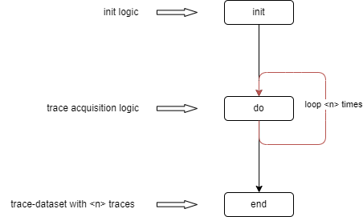

Acquisition
===========

`Acquisition` is responsible for managing the process of waveform data acquisition.

Data acquisition has two modes: `Test` and `Run`: `Test` and `Run`. The `Test` mode can be understood as a debugging mode, 
where real-time adjustments to the Cracker configuration and data acquisition settings can be made to achieve better data collection 
results (currently, this mode is meaningful only in the Jupyter environment, where waveforms can be viewed in real-time through the 
oscilloscope panel). In this mode, the acquired waveform data is not saved.

In the `Run` mode, the user cannot make real-time configurations to the device. This mode is mainly used for data collection after 
various parameter adjustments are completed. In this mode, the user can specify the file path and file format for saving the data.

The acquisition process consists of the following steps:

- Pre-initialization
- Initialization
- Post-initialization
- Pre-acquisition
- Data acquisition
- Post-acquisition
- Pre-completion
- Completion
- Post-completion

The end user mainly needs to focus on the Initialization and Data Acquisition steps, which are the `init` and `do` methods of the `Acquisition` class in the code. 
Typically, key settings for the device are made in `init`, while specific operations like encrypted data transmission and result reception are handled in `do`.

The flowchart is shown below:

Acquisition
-----------

.. autoclass:: cracknuts.acquisition.acquisition.Acquisition
    :members:
    :undoc-members:
    :private-members:
    :special-members:
    :inherited-members:
    :show-inheritance: