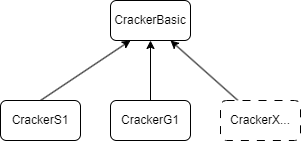

Cracker
=======

The `Cracker` module includes all operations on the device, such as device configuration, data transmission, and acquisition.

CrackerBasic
------------

.. autoclass:: cracknuts.cracker.cracker_basic.ConfigBasic

.. autoclass:: cracknuts.cracker.cracker_basic.CrackerBasic

CrackerS1
---------

.. autoclass:: cracknuts.cracker.cracker_s1.ConfigS1

.. autoclass:: cracknuts.cracker.cracker_s1.CrackerS1

CrackerG1
---------

.. autoclass:: cracknuts.cracker.cracker_g1.ConfigG1

.. autoclass:: cracknuts.cracker.cracker_g1.CrackerG1

CrackerO1
---------

.. autoclass:: cracknuts.cracker.cracker_o1.ConfigO1

.. autoclass:: cracknuts.cracker.cracker_o1.CrackerO1